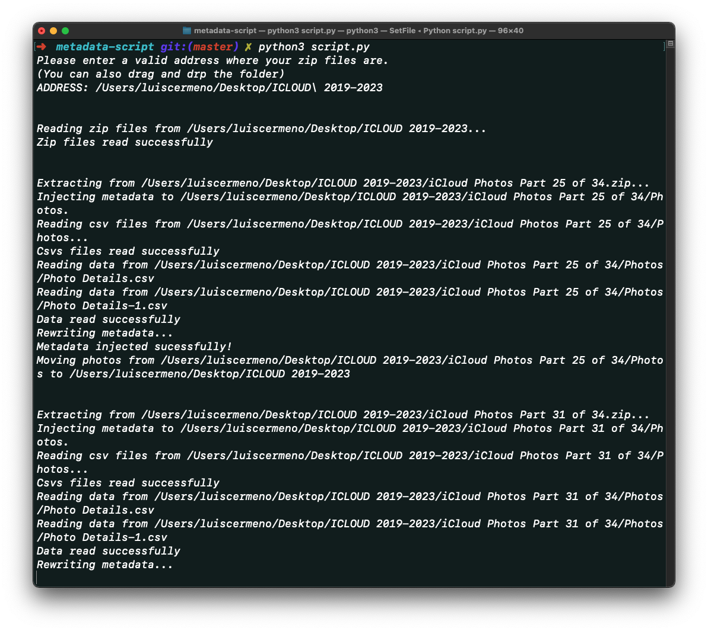

# iCloud Photo Library Extraction Tool

A **Python script** that extracts your iCloud Photo Library and updates important metadata such as **creation date** to each photo.



## iCloud and the infinite "purchase more storage" loop

We all know that the iCloud Photo Library can fill up quickly, and constantly purchasing more storage can become an expensive solution. However, there is a way to **avoid getting caught in an infinite pay for more storage loop**.

As of April 2023, Apple provides an option to download your entire iCloud Photo Library as compressed zip files upon request. This is a fast and convenient way to download all your photos, rather than having to download them in batches of 100s through the web interface. Once you have requested the compressed zip files, Apple will provide you with a link to download the files, which will allow you to easily access your entire photo library at once.

## The challenge

The download will look something like this:


The **challenge** with downloading your iCloud Photo Library as compressed zip files is that the contents of each zip file are completely randomized, making it difficult to organize your photo library locally. To add to the difficulty, each photo also comes with an incorrect creation date, which can aAdd to the confusion.

However, with the help of this **powerful tool**, you can quickly and easily extract the zipped files and inject the correct creation date for each photo, making it a breeze to organize your photo library locally. With the correct metadata in place, you can now **effortlessly manage and organize your photos**, and free up space in your cloud storage without the need to pay for additional storage.

By using this tool, you can enjoy the benefits of a well-organized photo library that is easily accessible and searchable, allowing you to relive and share your cherished memories with ease. It is important to note that while this tool can help you organize your photo library, it is always recommended to have a backup of your photos in case of unforeseen data loss.

## Objective

After executing the tool you will get your photos uncompressed in the same folder and the ability to sort them by their original creation date.


## Requirements

1. Mac OS.
2. Xcode Developer Tools.
3. Python3+

## How to run

Download script.py and run:  
```python3 script.py```